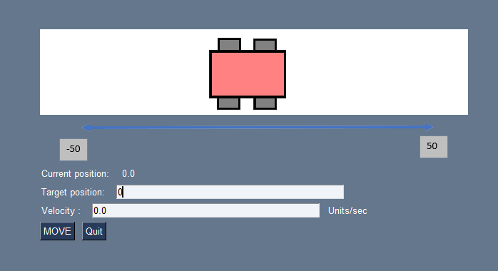

# robotic_car_GUI

robotic_car_GUI is a python programming exercise.
It contains a main.py script that create a window for show and control 1-d robotic car. 

# Installation guide

Go over the project folder and install setup.py using pip.

```bash
cd Xjet_robotic_car
pip install .
```

# Usage guide

After the installation of the project, write robotic_car inside the terminal and a GUI window will open.

```bash
robotic_car
```




For advance mode type robotic_car -mode advance command and the GUI that will open will implement advance physics 

```bash
robotic_car -mode advance
```